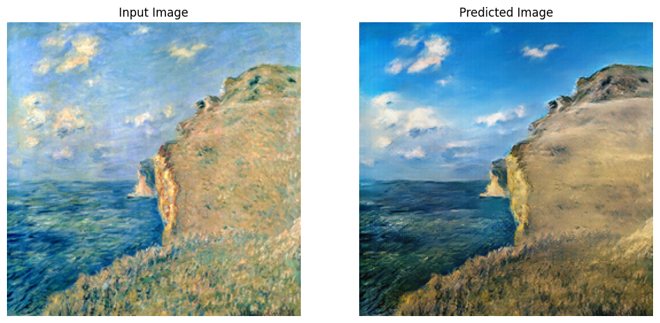

# VCPI - Painting into Photo

DeepLearning model capable of turning paintings into photos.

  

---

### Dependencies

This project requires the [Tensorflow](https://www.tensorflow.org/).

### Author

* [Rui Armada](https://github.com/RuiArmada)

### Grade

⭐(14.0/20)
