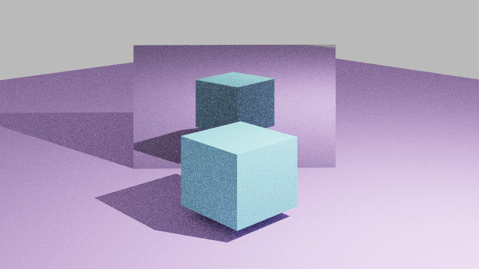

# Raytracer

Implementation of a Raytracer in C++.

## How to Run:

* For easy use it's advised to install [CLion](https://www.jetbrains.com/clion/download/#section=windows)
* Use the Build Function to compile everything
* Run `./vi-rt models/*.json` to generate a output image of the model as long as there's a *.json* file of it

## Deliveries

* 1st delivery: [commit](https://github.com/RuiArmada/Perfil-CG/tree/5170671ded043e09b49d0da998fb04dcf84b7a4b)
* 2nd delivery: [commit](https://github.com/RuiArmada/Perfil-CG/tree/ef04bb9f3ec9b568b2858653bc5ed20b98b01506) 
* 3rd delivery: [commit](https://github.com/RuiArmada/Perfil-CG/tree/02b743f2ac84a4baf863c4de1f931fa356e270e8) 

## Authors

* [Alexandre Flores](https://github.com/SugaryLump)
* [Pedro Alves](https://github.com/pta2002)
* [Rui Armada](https://github.com/RuiArmada)

## Grade

⭐ (19.0/20)

## Final Result

  

