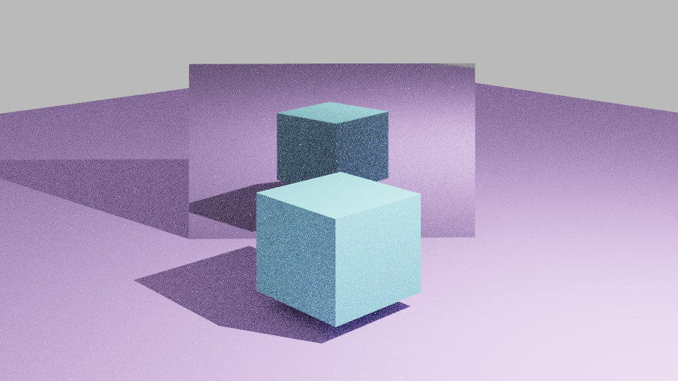

# Raytracer
Raytracer developed for a Visualization and Lighting course. It implements a phyisically-based shader, capable of rendering scenes exported out of Blender.

  

---

### How to Run:

* For easy use it's advised to install [CLion](https://www.jetbrains.com/clion/download/#section=windows)
* Use the Build Function to compile everything. Otherwise, run the `run.sh` script for easy use on linux
* Run `./vi-rt models/*.json` to generate a output image of the model as long as there's a `.json` file of it

### Authors

* [Alexandre Flores](https://github.com/SugaryLump)
* [Pedro Alves](https://github.com/pta2002)
* [Rui Armada](https://github.com/RuiArmada)

### Grade

⭐ (19.0/20)

---
  

   
<h4>📤 Deliveries</h4>

      <li>1st delivery: <a href="https://github.com/RuiArmada/Perfil-CG/tree/5170671ded043e09b49d0da998fb04dcf84b7a4b">commit</a>
</li>
      <li>2nd delivery: <a href="https://github.com/RuiArmada/Perfil-CG/tree/ef04bb9f3ec9b568b2858653bc5ed20b98b01506">commit</a>
</li> 
      <li>3rd delivery: <a href="https://github.com/RuiArmada/Perfil-CG/tree/02b743f2ac84a4baf863c4de1f931fa356e270e8">commit</a>
</li>
  

