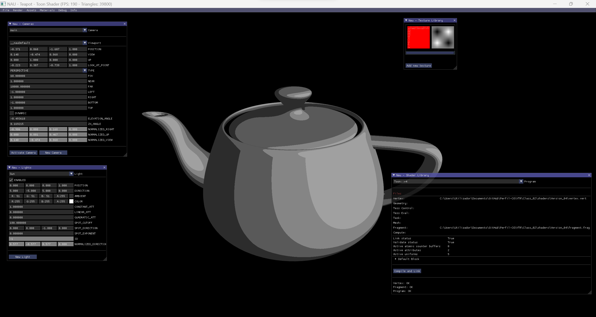
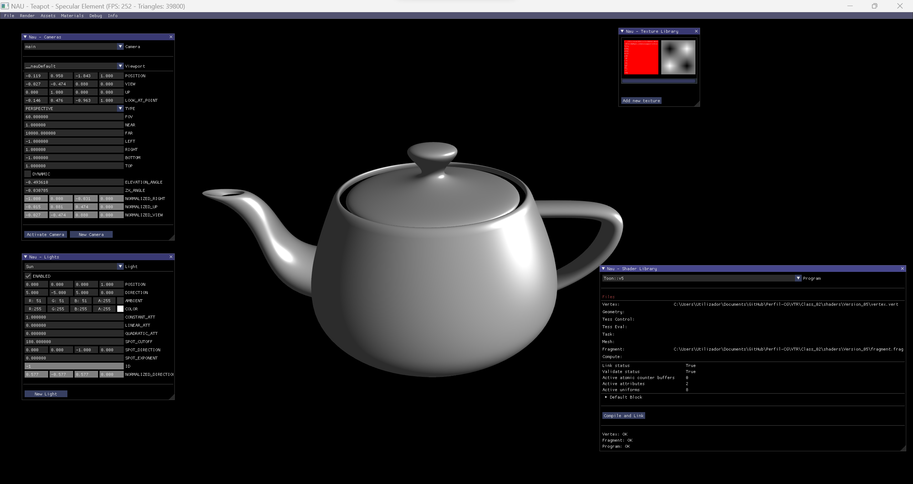

# Lecture 2

## Topics

* Toon Shading: from vertex shading (Gouraud) to per pixel shading (Phong)
* Normalization issues
* Specular component with Phong Equation

## Assignment

Implement lighting per pixel with specular component

## Toon Shader

  

## Specular Element

  

