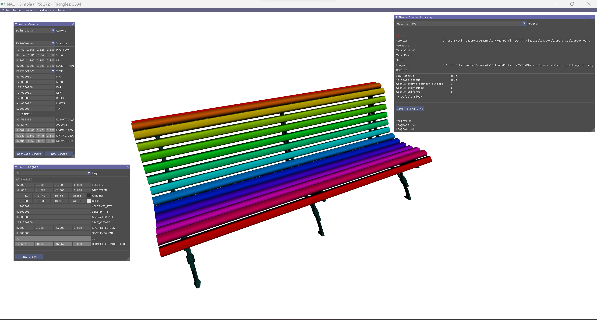

# Lecture 1

## Topics

* Course presentation and details of the assessment procedure
* The rasterization pipeline and its components
* Shader programming
* Brief introduction to NAU

## Assignment

Experiment with NAU graphics engine

## Final Result

  

