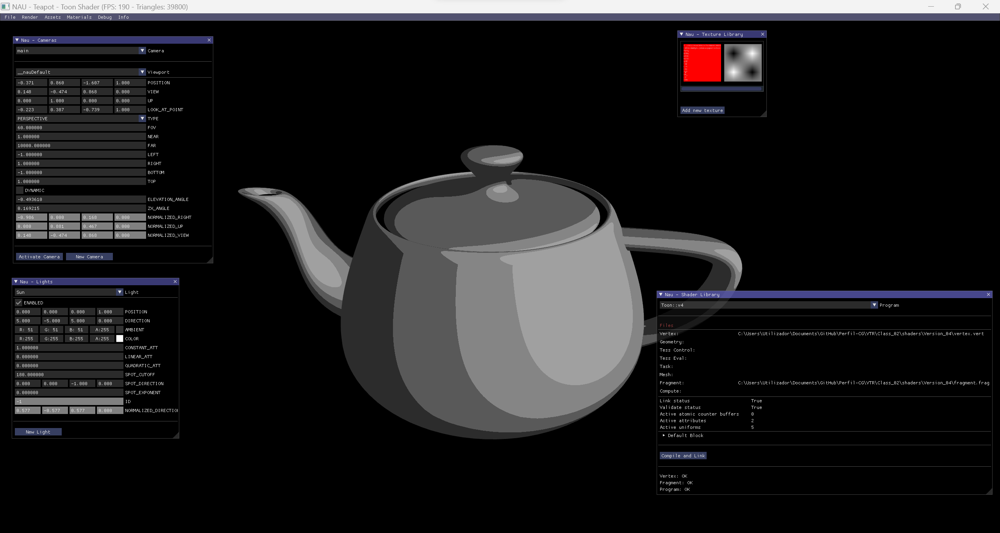

# Lecture 2

  
  

> Left: ToonShader | Right: Specular Element

---

## Topics

* Toon Shading: from vertex shading (Gouraud) to per pixel shading (Phong)
* Normalization issues
* Specular component with Phong Equation

## Assignment

Implement lighting per pixel with specular component
