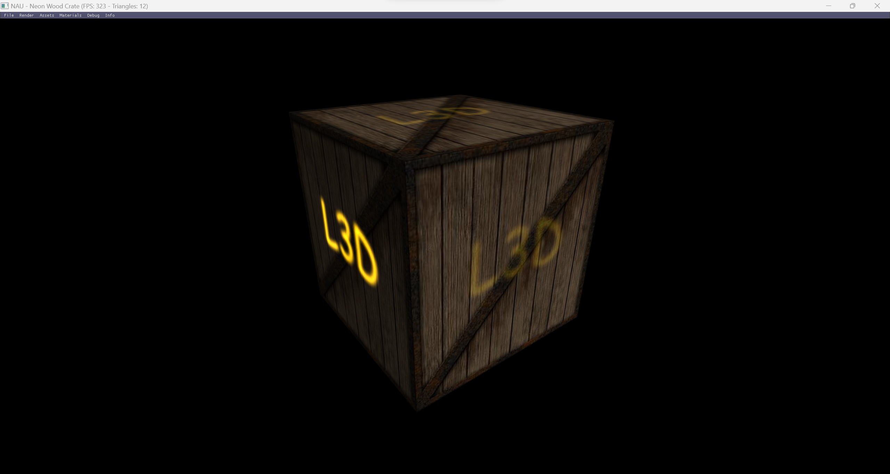

# Lecture 4

  

---

## Topics

* Texture coordinates as a vertex attribute
* Usage of texture coordinates as data
* Implementing functions based on texture coordinates

## Assignment

Update the shaders to perform multitexturing on a cube

