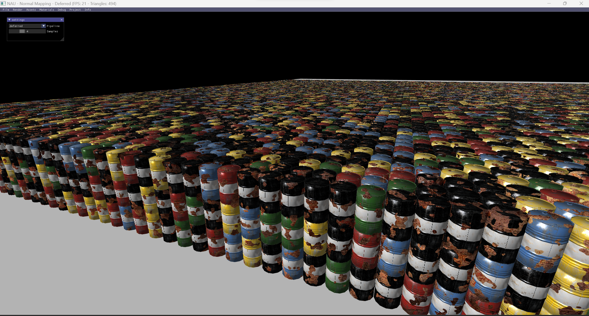

# Lecture 7

  

---

## Topics

* Normal mapping and bump mapping
* Tangent space and the TBN matrix
* Computing NM in camera space
* Deferred Rendering and Multisampling

## Assignment

Implement normal mapping
