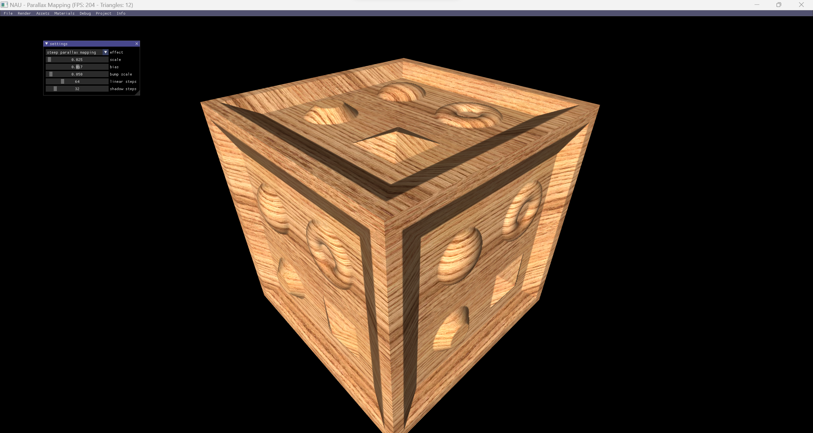

# Lecture 8

## Topics

* Computing NM in tangent space and in camera space
* Normal mapping issues
* Parallax mapping
* Steep parallax mapping

## Assignment

Implement deferred mapping, deferred multisampling and parallax mapping

## Final Result

  

