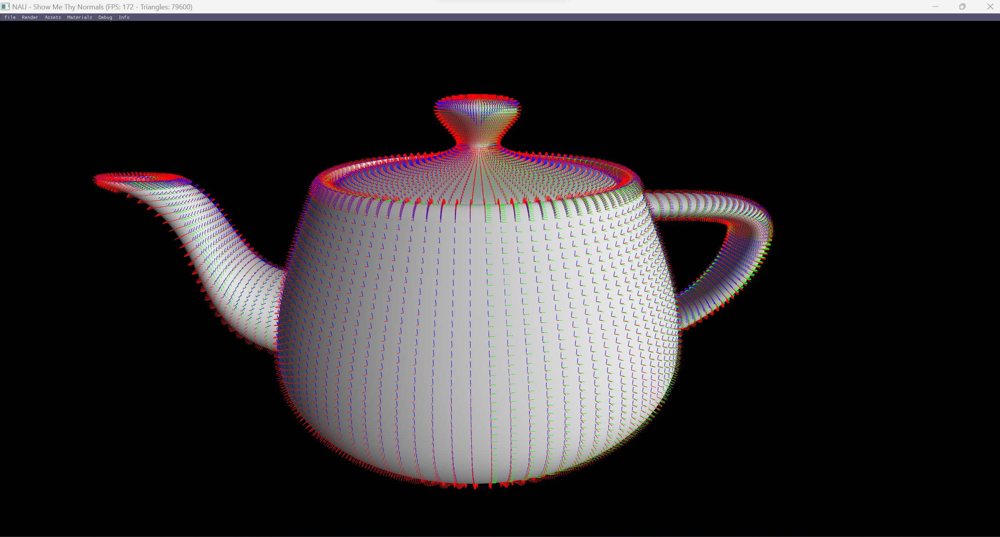

# Lecture 9

## Topics

* Geometry Shader: where it fits on the graphics pipeline, features and use cases

## Assignment

Implement a way to show the normals using geometry shader

## Final Result

  

