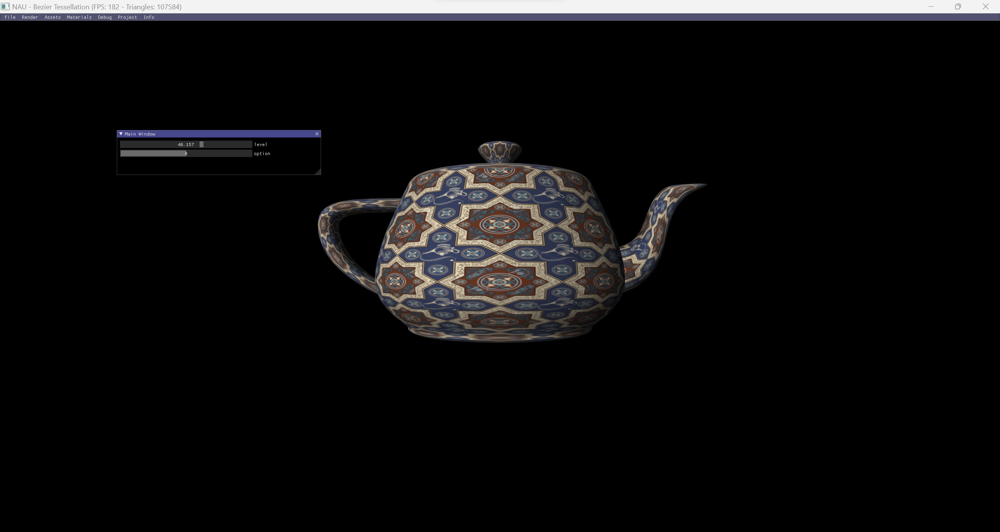
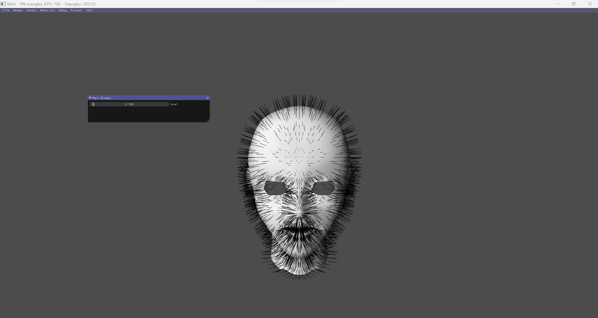

# Lecture 10

  
  

---

## Topics

* Features and functionality of the Tessellation shaders
* The full graphics pipeline
* The tessellation process
* Bezier patches, PN-Triangles, Phong tessellation

## Assignment

Implement Phong Tessellation
