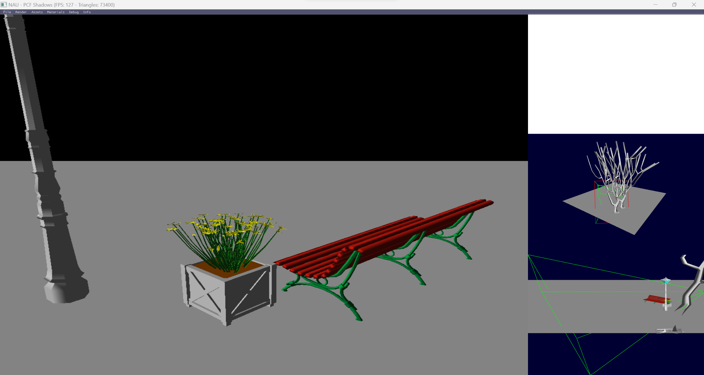

# Lecture 12

  

---

## Topics

* Shadow Volumes
* Shadow Maps: Vanilla version, PCF, VSM and ESM
* Trapezoidal Shadow Maps and Parallel split shadow maps

## Assignment

Complete the project to implement PCF shadows

> Note: unfinished