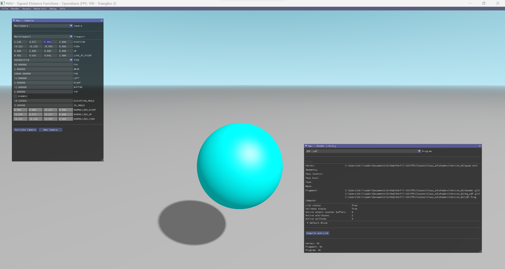

# Lecture 14

## Topics

* Geometric solid constructive geometry
* Ray marching in signed distance fields
* Signed distance field operators

## Assignment

Complete the project to implement a ray caster on a SDF and compose a scene using the SDF operators

## Final Result

  

