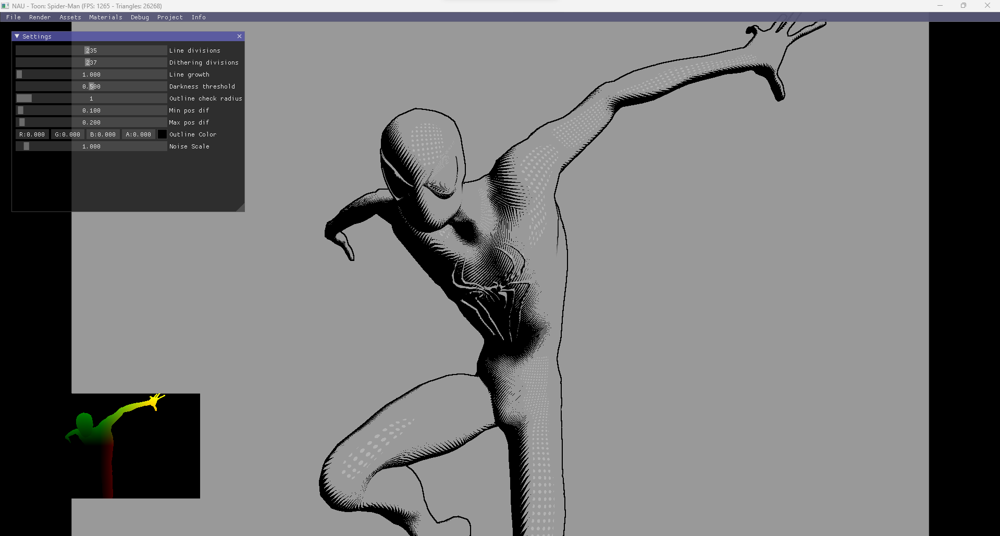

# Comicbook Shader

Implementation of stylized comic-book like shader (Non-Photorealistic Rendering).

  

---

### Dependencies

This project requires the [NAU](https://github.com/Nau3D/nau) 3D Engine.

### How to Run

* Go to the [scenes](scenes/) directory
* Drag and drop any `.xml` into NAU's `composerImGui` application file.

### Authors

* [Alexandre Flores](https://github.com/SugaryLump)
* [Pedro Alves](https://github.com/pta2002)
* [Rui Armada](https://github.com/RuiArmada)

### Grade

⭐ (6.5/7)

